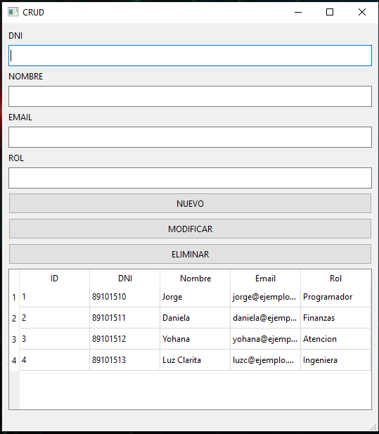
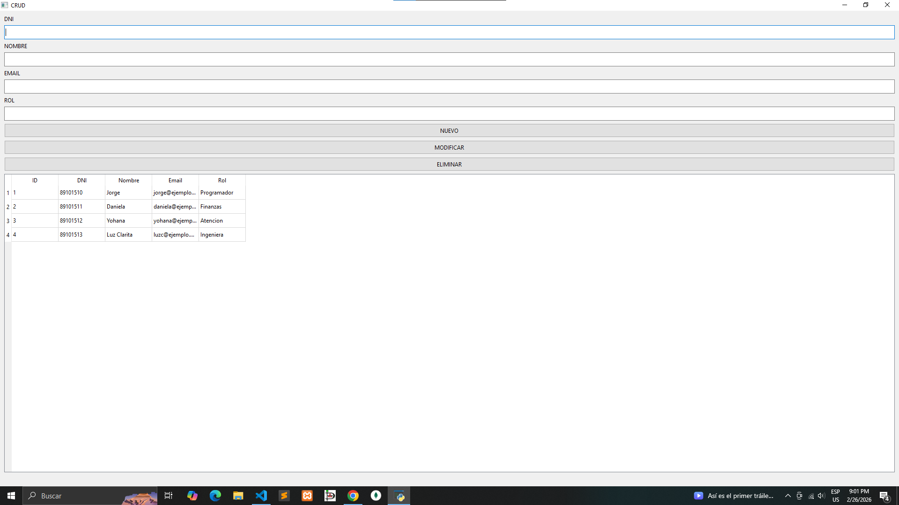

# Project software with Python, Qt/Pyside, MySQL

This project have a functions gestions efficient of data user in business, 
principal functions is register, reading, update, delete of information of
users.

## Used tools

- Python
- Qt/Pyside
- MySQL

## Installating

- Clone this repository
- Download database

## Vistas previas

